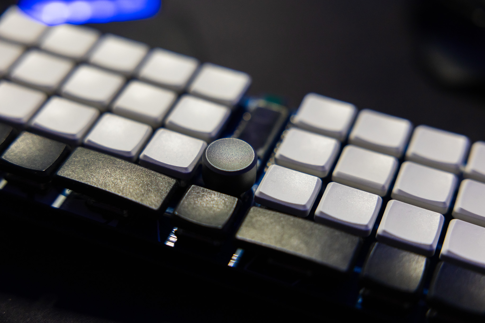
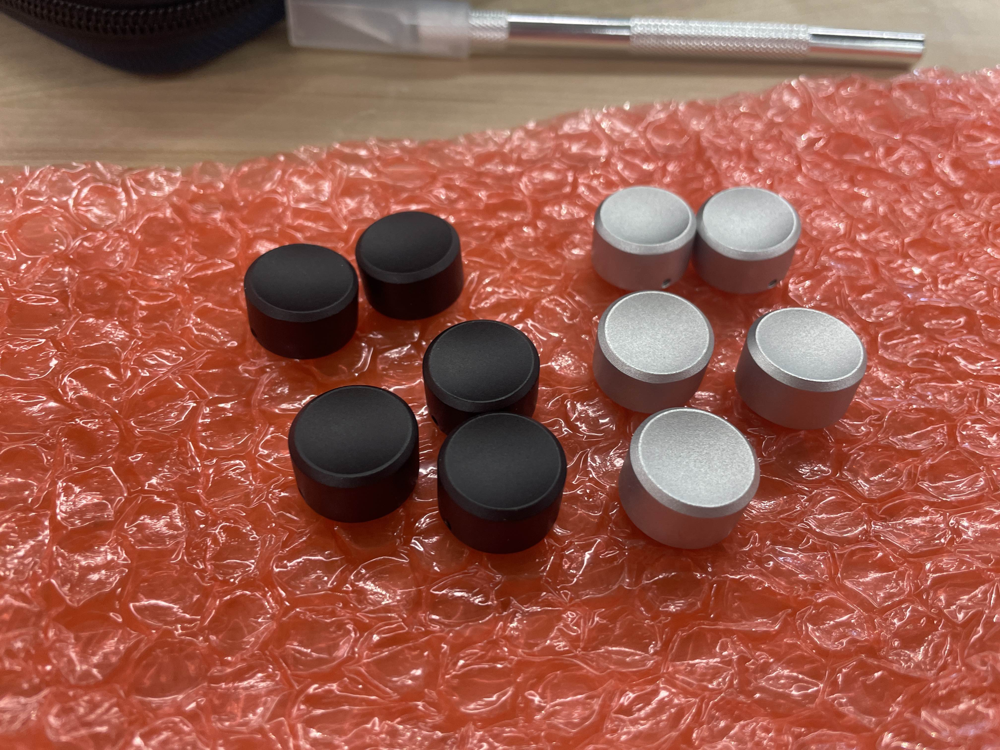

# Boards
### [Back to main list of boards](https://github.com/MakerJake01/MakerJakes-keyboards) 

## The J0K is a EC12 compatible knob with an M2 set screw.

The EC12 encoder is an amazing low profile. They have successfully been manufactured.

The two files both work. The one called `EC12Knob_Rect.step` has an extra internal feature to lock with the encoder. `EC12Knob.step` lacks this feature and is more compatible with a lathe based workflow.

Use the file `KnobThreads.pdf` to indicate to the manufacturer where and what threads to use.

# Parts
| Part        | Number      | Note |
| :---        |    :----:   |          ---: |
| Knob   | 1           |  |
| M2 Set Screw | 1 |  |

# Build Notes
Use 0.9 mm Hex L-Key

# Where to Buy 
To get the most info join my discord server. You can buy and print the parts needed youself. 

 