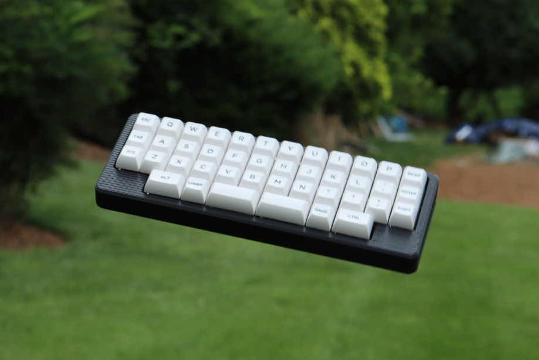
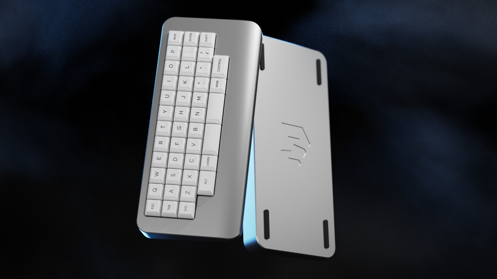

# J42Ki
### [Back to main list of boards](https://github.com/MakerJake01/MakerJakes-keyboards) 

## The J42Ki is a modified version of the tray mount J42K with an integrated controller and daughter board.

The board retains the J42K's bottom row compatibility. 

# PCB
PCB files have not yet been released. 

# Case
The case shown in the photo is a modified 3dp case from the original J42K designed by Glow. I am working on an updated case and hope to get it manufactured soon. Below is a render I created. 

# Firmware 
It runs [QMK](https://qmk.fm) and the exact firmware very out of date.

# Parts
| Part        | Number      | Note |
| :---        |    :----:   |          ---: |
| PCB         | 1           | uses an atmega32u2  |
| Case        | 1           | Unibody case either cnc or 3dp |
| Jst         | 1           | |
| uDB         | 1           | any c variant should function. 
| M2 screws   | 8           | four for the db and four for the case |

# Where to Buy 
change this at some point. To get the most info join my discord server. You can buy and print the parts needed youself. 

Go to the `#choose-roles` channel and type 
~~~
!join J42K
~~~

 