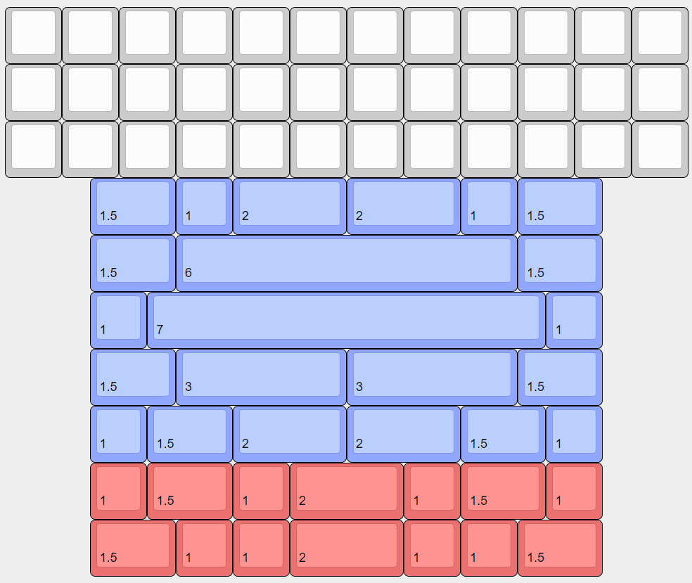

# Boards
### [Back to main list of boards](https://github.com/MakerJake01/MakerJakes-keyboards) 

## The J42K is a PM based tray mount 12u HHKB ortho hotswap keyboard. 

It has been designed to have many options for the bottom row. Below is a KLE showing the layout.  

# J42Ki

Improved itegrated version of the board. More info can be found [here!](https://github.com/MakerJake01/MakerJakes-keyboards/tree/main/J42K/J42ki). 

# The mistake
I messed up the main pcb because one of the switch footprints was off of the 19.05x19.05 grid. I was able to fix the pcb with a drill and a ton of time. It has been fixed in later revisions of the pcb. 

# Pcb
There is only one pcb needed for this board. I ordered mine from [JLCPCB](https://jlcpcb.com) and the quailty is great.  

# Case
The top and bottom case files can be found [here](). I printed both of mine from PLA. The quality does not matter to much. Sometimes the tray mounting points can snap off. 

# Firmware 
It runs [QMK](https://qmk.fm) and the exact firmware very out of date.

# Parts
| Part        | Number      | Note |
| :---        |    :----:   |          ---: |
| ProMicro   | 1            |  |
| Case       | 1            | 3d printed |
| M2 screws  | 4            | there are more mounting points in the case but four works |

# Where to Buy 
change this at some point. To get the most info join my discord server. You can buy and print the parts needed youself. 

Go to the `#choose-roles` channel and type 
~~~
!join J42K
~~~

 
