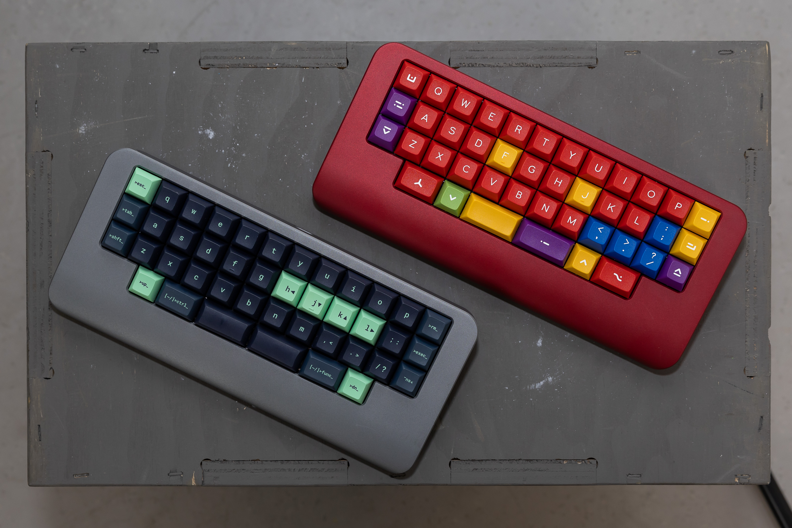

# Boards
### [Back to main list of boards](https://github.com/MakerJake01/MakerJakes-keyboards) 

## The J42K is a bottom mount 12u HHKB ortho hotswap keyboard.

This keyboard is the third iteration is the [J42K](https://github.com/MakerJake01/MakerJakes-keyboards/tree/main/J42K) series. It has a center mount UDB. The bottom row layouts remain the same from previous versions. 

# Pcb
The first version of the PCB was designed with an Atmega32u2 and the second version used in the GB has an STM32f07.

# Case
The case has been designed to be milled out of aluminum. 

# Firmware 
It runs [QMK](https://qmk.fm) however the QMK files needs to be updated to match the new MCU.

# Parts
| Part        | Number      | Note |
| :---        |    :----:   |          ---: |
| PCB   | 1  |  |
| Plate | 1 | |
| Universal Daughter board | 1 | |
| M2x3 Screw | 4 | |
| M2x6 Screws | 4 | Unsure about length | 

# Build Notes

# Where to Buy 
change this at some point. To get the most info join my discord server. You can buy and print the parts needed youself. 

Go to the `#choose-roles` channel and type 
~~~
!join 
~~~

 