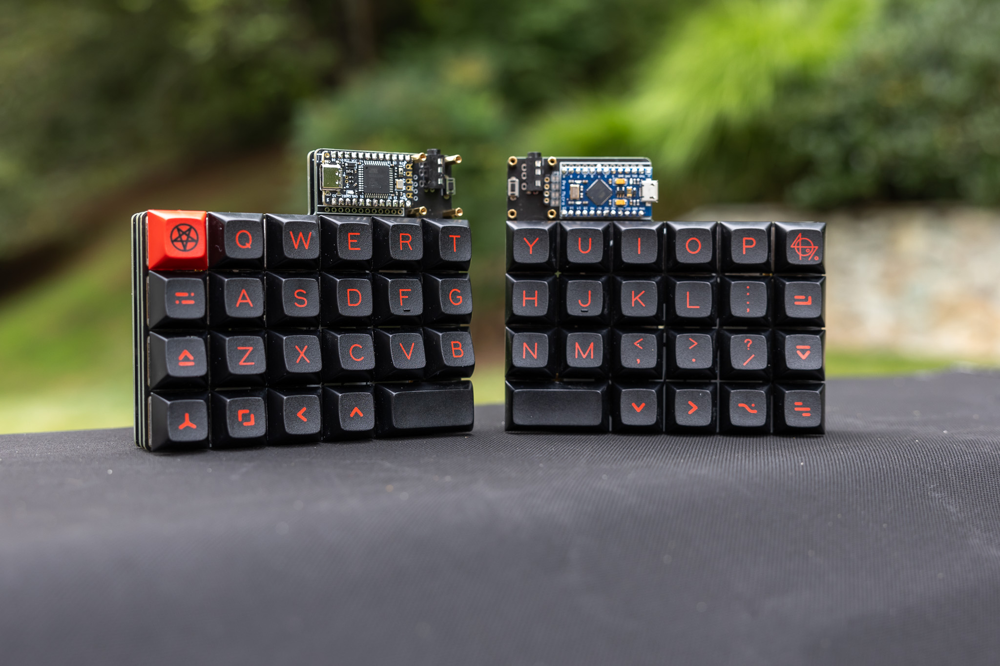

# Boards
### [Back to main list of boards](https://github.com/MakerJake01/MakerJakes-keyboards) 

## The J46Kr is a split reversible hot swap promicro based keyboard with back lighting and an OLED inspired by the [Rhymestone](https://www.boardsource.xyz/products/Rhymestone).  

description

# Pcb
The zip file can be found [here](). There is only one pcb needed for this board. I ordered mine from [JLCPCB](https://jlcpcb.com) and the quailty is great.  

# Case
This board uses an FR4 skeleton case that uses m2 screws. PM and OLED covers have not yet been designed.

# Firmware 
It runs [QMK](https://qmk.fm) and the exact firmware is [here](). 

# Parts
| Part        | Number      | Note |
| :---        |    :----:   |          ---: |
| ProMicro   | 1           |  |

# Build Notes

# Where to Buy 
change this at some point. To get the most info join my discord server. You can buy and print the parts needed youself. 

Go to the `#choose-roles` channel and type 
~~~
!join 
~~~

 