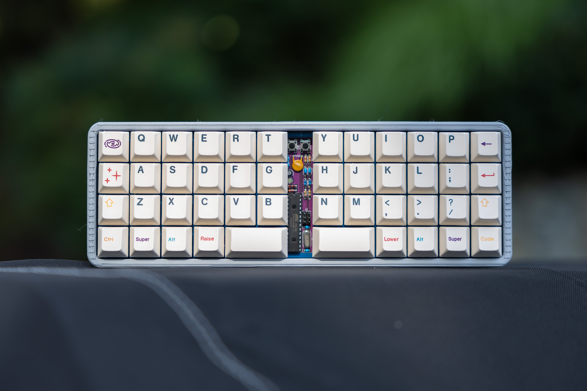

# Boards
### [Back to main list of boards](https://github.com/MakerJake01/MakerJakes-keyboards) 

## The J46Kvan is a minivan sized mx hotswap 12u atmega328p based keyboard.

This pcb is designed to work with tray mount cases but some of the screw holes are hard to access with the switches in place. On the bottom row there is a choice of 2x1u or 1x2u for each side of the bottom row.This board was heavily ispired by the [romeo by coseyfannitutti](https://github.com/coseyfannitutti/romeo) and [squashkb's Lesovoz](https://trashman.wiki/community/pcbs/lesovoz). It also uses [coseyfannitutti fork of USBasp](https://github.com/coseyfannitutti/USBaspLoader/tree/atmega328p).

# Pcb
The pcb and plate files are not yet public.

# Case
With the right plate this is compatible with "normal" minivan cases.

# Firmware 
It runs [QMK](https://qmk.fm) and the exact firmware is [here](). 

# Parts
| Part        | Number      | Note |
| :---        |    :----:   |          ---: |
| atmega328p  | 1           | Needs to be burned with a bootloader |
| chip socket | 1 | |
| 22pf | 2 | Disc_D3.0mm_W1.6_P2.50mm |
| .1uf | 2 | Disc_D4.2mm_W1.9_P4mm |
| 4.7uf | 1 | D4.0mm_P1.50mm |
| Bav70 | 24 | diode | 
| 3.6v zener | 2 | DO-35 |
| Led | 1 | D3.0mm |
| 500ma polyfuse | 1 | 5.1mm lead spacing |
| USB C | 1 | GCT_USB4085 | 
| Isp programmer | 1 | 2x3 |
| 5.1k | 2 | 1/6 W |
| 1.5K | 2 | 1/6 W |
| 75 | 2 | 1/6 W |
| 10k | 1 | 1/6 W |
| Kailh socket | 46 - 48 | |
| push button | 2 | 6x6 |
| crystal | 1 | 16mhz HC49-4H |

# Build Notes

# Where to Buy 
change this at some point. To get the most info join my discord server. You can buy and print the parts needed youself. 

 