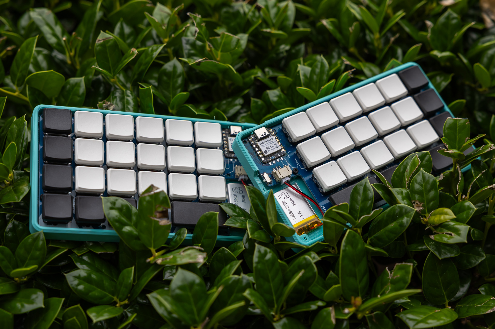

# Boards
### [Back to main list of boards](https://github.com/MakerJake01/MakerJakes-keyboards) 

## The J46Kx [Seeeduino Xiao](https://www.seeedstudio.com/Seeed-XIAO-BLE-nRF52840-p-5201.html) based reversible 12u split ortho hotswap low profile keyboard. 

This board was designed after the release of the Xiao nRF52840 for use with ZMK. It uses bav70 diodes and has footprints for hot swap choc switches. The layout is a fixed 2x2u for the bars. There is an optional pad for an led.

# Pcb
The first version of the pcb was difficult to solder as the pads under the Xiao needed a hot air reflow station to solder them to the pcb. An updated but untested pcb has been created that uses a larger hole to solder to the pads. The board uses 3 contact jst connectors to allow for both - + and + - battery connectors to plug in (the center pin is for -).

# Case
The top and bottom case files can be found [here](). I printed both of mine from PLA. The quality does not matter to much. 

# Firmware 
It runs [ZMK](https://zmk.dev/) and the exact firmware is [here](https://github.com/MakerJake01/zmk-config). 

# Parts
| Part        | Number      | Note |
| :---        |    :----:   |          ---: |
| ProMicro   | 1           |  |

# Build Notes

# Where to Buy 
change this at some point. To get the most info join my discord server. You can buy and print the parts needed youself. 

Go to the `#choose-roles` channel and type 
~~~
!join 
~~~

 